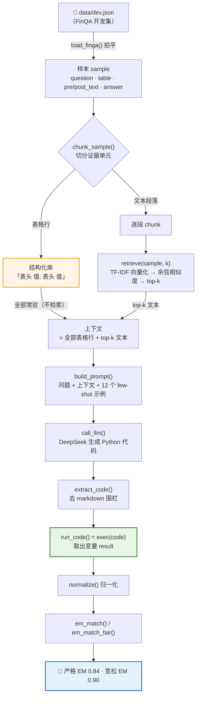

# FinRAG · 上市公司财报数值推理问答

<p align="center">
  <a href="#"></a>
  <a href="#"></a>
  <a href="#"></a>
  <a href="#"></a>
  <a href="#"></a>
</p>

<p align="center"><b>Retrieval-Augmented <i>Code</i> Generation</b> — 不是“检索 + 生成答案”，而是“检索 + 生成代码 + 执行”。</p>

基于 **检索增强生成（RAG）** 的财报数值推理系统。给定一个财报问题（如 *“2016 年未确认税收优惠相较 2015 年变化了百分之几？”*），系统从财报表格与文本段落中检索相关证据，让大模型**生成一段 Python 程序**并**执行**，得到**精确到数值**的答案。

在 **FinQA** 基准的 100 条开发集样本上达到：

| 口径 | 得分 | 含义 |
|---|---|---|
| **严格 EM** | **0.84** | 精确匹配（1% 相对误差） |
| **宽松 EM** | **0.90** | 2 位有效数字对齐 |

> 🚀 **开箱即用**：这不止是一套评测脚本——还提供两个可直接使用的入口：命令行 `ask.py`（粘贴财报 → 循环提问）和 Web `app.py`（Streamlit 网页问答，可视化「取了哪几个数、怎么算」）。见 [快速开始](#快速开始)。

---

## 亮点速览

| 指标 | 结果 |
|---|---|
| 评测基准 | [FinQA](https://github.com/czyssrs/FinQA)（财报数值推理权威基准） |
| 评测集 | `dev.json` 前 100 条样本 |
| 证据召回 | recall@20 = **0.9529** |
| 检索方案 | 表格行**整表常驻** + 文本 TF-IDF，零外部服务、零向量数据库 |
| 方法论 | 程序归纳（Program Induction）——让 LLM 写 Python 代码，交给解释器算 |

**它解决了什么问题**：财报问答不是“从文档里找一句话”的抽取式问答，而是需要**跨单元格、跨行的多步数值推理**，且答案必须**精确**。纯靠语言模型“心算”会出错——本系统把“计算”这一环彻底交给 Python 解释器，语言模型只负责“读懂问题、写出计算逻辑”。

---

## 目录

- [亮点速览](#亮点速览)
- [背景与问题定义](#背景与问题定义)
- [核心设计:为什么让 LLM 写代码,而不是直接答](#核心设计为什么让-llm-写代码而不是直接答)
- [整体架构](#整体架构)
- [端到端示例](#端到端示例)
- [技术栈](#技术栈)
- [模块详解](#模块详解)
- [检索的细节与优化](#检索的细节与优化)
- [评估:双口径 EM](#评估双口径-em)
- [消融实验:每一步改动的贡献](#消融实验每一步改动的贡献)
- [数据标注修复](#数据标注修复)
- [剩余挑战与根因分析](#剩余挑战与根因分析)
- [文件结构](#文件结构)
- [快速开始](#快速开始)

---

## 背景与问题定义

**任务**：给定一家上市公司某一年度的财报（以表格 `table` + 段落 `pre_text`/`post_text` 形式组织），和一个数值型问题，输出精确的数值答案。

**难点**：这不是“从文档里找一句话”的抽取式问答，而是需要**跨单元格的数值推理**：

> 例：「2010 年 statutory capital and surplus 与 statutory net income 的比值是多少？」→ 需要从两行里各取 2010 列的值，做除法。

这要求系统具备「理解问题 → 定位证据 → 执行多步算术」的能力，而算术必须**精确**，纯靠语言模型“心算”会出错。

**数据**：[FinQA](https://github.com/czyssrs/FinQA) 数据集（财报数值推理的权威基准），本项目使用其 `dev.json` 开发集的前 100 条样本做评测。

---

## 核心设计:为什么让 LLM 写代码,而不是直接答

这是本项目最核心的方法论决策，也是 FinQA 官方采用的“程序归纳”路线。

**问题**：财报数值推理的答案必须**精确到数值**（如 `-4088.333`、`72.83%`）。如果让 LLM 直接生成答案文本：

- 它需要“心算”多步算术（求和、除法、百分比变化），容易在数值上出错；
- 生成的答案带自由文本，难以做精确匹配评估。

**方案**：让 LLM 生成一段**可执行的 Python 代码**，再由 `exec` 执行，取出名为 `result` 的变量作为最终答案：

```python
# 问题: what was the percentage change in the net carrying amount in 2010?
begin = 920 - 95
end = 469 - 77
result = (end - begin) / begin * 100   # → -42.6...
```

**分工**：

| 角色 | 职责 | 特性 |
|---|---|---|
| **LLM** | 理解问题语义、定位证据单元格、写出计算逻辑 | 易错，但可被 few-shot 引导 |
| **Python 解释器** | 执行算术 | 100% 精确 |

这样，数值精度由解释器保证，系统只需要引导 LLM “写对程序”。

---

## 整体架构



---

## 端到端示例

拿一道真实样本走完整条链路，看系统是怎么“解”的：

**① 输入问题**

> what was the percentage change in the net carrying amount in 2010?

**② 检索到的上下文**（表格行整表常驻，模型直接拿到）

```
[表格行] carrying amount;2010 $ 469;2009 $ 920
[表格行] allowance;2010 $ 77;2009 $ 95
```

**③ LLM 生成的代码**

```python
begin = 920 - 95
end = 469 - 77
result = (end - begin) / begin * 100
```

**④ 执行结果**

```
result = -42.6...
```

**⑤ 与标准答案匹配**：标准 `-42.6%`，相对误差 1% 内 → ✅ 命中。

> 关键是第 ③→④ 步：LLM 只负责把“净额先减后除”的语义翻译成代码，`-42.6` 这个精确数值是解释器算出来的，不是语言模型“猜”出来的。

---

## 技术栈

| 组件 | 版本 | 在项目中的角色 | 为什么选它 |
|---|---|---|---|
| **Python** | 3.11 | 主语言 + 代码执行引擎 | 数据科学生态成熟，`exec` 可直接执行生成代码 |
| **LangChain**（`langchain-openai` / `langchain-core`） | — | LLM 调用的统一抽象层 | 用 `ChatOpenAI` 兼容接口，一行切换 LLM 提供商；`SystemMessage`/`HumanMessage` 结构化消息 |
| **DeepSeek API** | `deepseek-v4-pro` | 实际的推理大模型 | 通过 OpenAI 兼容 `base_url`，成本低、数值推理能力够用 |
| **scikit-learn** | 1.5.2 | 检索：TF-IDF 向量化 + 余弦相似度 | 轻量、无外部服务、召回够用，无需引入向量数据库 |
| **python-dotenv** | — | 从 `.env` 加载 API Key | 密钥不入库 |
| **Streamlit** | 1.63 | Web 交互界面（`app.py`） | 纯 Python 快速搭建问答 UI，零前端代码 |
| **`exec`（内置）** | — | 执行 LLM 生成的 Python 代码 | 把“计算”交给解释器，保证数值精确 |

> 关键点：这里的 RAG **不是**“检索 + 生成自然语言答案”，而是**“检索 + 生成代码 + 执行”**。LLM 只负责“读懂问题、写出计算逻辑”，真正的数值运算由 Python 解释器完成——这就是它能拿到精确数值答案的根本原因。

---

## 模块详解

### `data_loader.py` — 数据加载

FinQA 原始 `dev.json` 的每条样本是嵌套结构（`item["qa"]` 里含 question/answer/program 等）。`load_finga(path, limit=None)` 负责**拍平**，输出统一字典：

```python
{
    "id": "CB/2010/page_200.pdf-4",
    "question": "...",
    "answer": "4.9",              # gold 答案
    "program": "divide(11798, 2430)",  # gold 程序（仅用于核对）
    "table": [[...], [...]],      # 二维表，首行是表头
    "pre_text": [...],            # 表格前的段落
    "post_text": [...],           # 表格后的段落
    "ann_table_rows": [...],      # 标注的表格行号
    "ann_text_rows": [...],       # 标注的文本行号
}
```

> `ann_*_rows` 是人工标注的“证据位置”，本系统用它做检索的 **recall 评测**（见下文），**推理阶段不使用**（不能偷看答案）。

### `retriever.py` — 检索

负责把一条样本变成“上下文候选”。

- **`chunk_sample(sample)`** 切分证据单元：
  - **文本**：`pre_text + post_text` 的每段 → 一个 chunk，标记 `("text", i)`；
  - **表格**：表头 + 每一数据行拼成 `"表头 值;表头 值"` 字符串 → 一个 chunk，标记 `("table", r)`。
- **`retrieve(sample, k)`** 做检索：对全部文本 chunk 做 TF-IDF 向量化，把问题也向量化，用余弦相似度排序取 top-k。
- **`eval_recall(samples, k)`** 用 `ann_*_rows` 评测“证据召回率”（gold 证据命中的比例）：

| k | recall |
|---|---|
| 5 | 0.68 |
| 10 | 0.85 |
| **20** | **0.9529** |

### `prompt.py` — few-shot 提示词

`SYSTEM_PROMPT` 是中文的系统提示，包含**规则 + 12 个 few-shot 示例**。每个示例对应一类财报算术模式，是调高分数的关键杠杆：

| 示例 | 教会模型什么 |
|---|---|
| 1 | 跨年份求和（从 `;` 分隔的单元格取数） |
| 2 | 资本充足率 = 资本 ÷ 风险加权资产 |
| 3 | percent-of 单一列，不要误加其他列 |
| 4 | 百分比变化（先算净额再求变化率） |
| 5 | 从文本提取单个数字 |
| 6 | 反推（已知 X 是 Y% of Z，求 Z） |
| 7 | average = sum ÷ 个数 |
| 8 | 占当年 total 的比例（分母是当年，不是各年求和） |
| 9 | portion/占比要 ×100 |
| 10 | “by how much...increase” 是百分比变化 |
| 11 | fair value of common stock 要除以股数 |
| 12 | “increase in ... in thousands” 是绝对差 |

> few-shot 措辞非常讲究——记忆里有个教训：示例 2 最初用 `tier 1 capital` 措辞，换成真实题目的 `common equity tier 1 (cet1)` 才救回那道题。**示例要和真实题目的措辞对齐**，不能泛泛而谈。

### `reasoner.py` — 生成 + 执行 + 评估（主流程）

核心函数：

- **`get_llm()`**：`ChatOpenAI(base_url="https://api.deepseek.com/v1", model="deepseek-v4-pro", temperature=0)`。`temperature=0` 保证确定性输出。
- **`solve(sample, k)`**：检索 + 生成 + 执行，返回 `(pred, code)`。
- **`extract_code(raw)`**：正则抠出 markdown 围栏里的 Python 代码（LLM 常输出 ` ```python ... ``` `）。
- **`run_code(code)`**：`exec` 执行，`try/except` 兜底（执行失败返回 `None`），取出 `ns["result"]`。
- **`normalize(x)`**：答案归一化——小写、去逗号/`$`/`%`/字面 `\n`，方便对齐。
- **`em_match` / `em_match_fair`**：双口径评估（见下）。
- **`eval_em_debug`**：跑全量样本，打印错题（问题/标准/预测/生成的代码），便于逐题诊断。

---

## 检索的细节与优化

这是本项目踩坑最多、也最关键的地方之一。

**初版问题**：把所有 chunk（文本 + 表格行）都丢进 TF-IDF 检索 top-k。但表格里有很多**“纯数字/年份行”**：

```
class a common stock;december 31 , 2017 339235;december 31 , 2016 338240
```

这类行**没有语义关键词**，TF-IDF（基于词频）根本召不回它们，导致“取某年某列值”的题直接拿不到证据。

**优化：整表常驻**。`solve` 里改为：

```python
for text, key in chunk_sample(sample):
    if key[0] == "table":      # 表格行全部常驻，不检索
        chunks.append((key, text))
for key in retrieve(sample, k):
    if key[0] == "text":       # 只对长文本做 TF-IDF 检索
        chunks.append((key, key2text[key]))
```

**理由**：表格是结构化数据，行数有限（几十行），**全部放进上下文也不会超 token**；而文本段落长、信息密度低，才需要 TF-IDF 裁剪。这一改动根治了“纯数字行召不回”的问题。

---

## 评估:双口径 EM

精确匹配（Exact Match）是 FinQA 的标准指标。但 FinQA 的 `answer` 字段是**人工抄写、带舍入噪声**的（同一个真实数值，有的标 `-1%`、有的标 `-1.072%`）。为公平反映模型真实能力，本项目用**两个口径**：

### 严格 EM `em_match(pred, gold)`

先 `normalize`，再判等：

1. 字符串相等 → 对；
2. 否则两边转 `float`，**相对误差 ≤ 1%**（对接近 0 的答案用 `1e-2` 绝对兜底）→ 对；

```python
return abs(fp - fg) <= max(1e-2 * abs(fg), 1e-2)
```

### 宽松 EM `em_match_fair(pred, gold)`

把两边都**四舍五入到 2 位有效数字**（`round_sig(x, 2)`）再比，吸收 gold 的舍入噪声：

| 例子 | 严格 | 宽松 |
|---|---|---|
| 预测 `1.0499` vs 标准 `1.0` | ❌（差 4.99%） | ✅（都 → 1.0） |
| 预测 `-1.072` vs 标准 `-1%` | ❌（差 7%） | ❌（→ -1.1 vs -1.0，gold 只留了 1 位） |

一句话：**严格 EM 是“精确到 1%”的硬标准，宽松 EM 是“容 gold 四舍五入到 2 位有效数字”的公平标准。**

---

## 消融实验:每一步改动的贡献

从朴素基线到最终分数，关键改动及其作用：

| 步骤 | 改动 | 作用 |
|---|---|---|
| 0 | 朴素 RAG + LLM 直接答 | 基线，约 20–40% |
| 1 | **路线切换**：LLM 生成代码 + `exec` 执行 | 数值精确，核心方法论 |
| 2 | 评估改**相对误差 1%**（救 `34.011↔34`、`-52.48↔-52.5` 假阴性） | 消除评估误判 |
| 3 | 检索 k=10→20（召回 rank 10–18 的边界行） | 证据召回 `0.85→0.95` |
| 4 | **整表常驻**（表格行不走 TF-IDF） | 根治“纯数字行召不回” |
| 5 | few-shot 扩到 **12 示例** | 治 portion×100、fair value÷股数、increase 绝对差等可枚举规则错误 |
| 6 | **FIX_ANSWERS** 修 5 处数据标注 bug | 消除 gold 本身的错误 |
| 7 | normalize 去 `$`/`%`/逗号/字面 `\n` | 消除答案格式噪声 |

最终：**严格 EM 0.84 / 宽松 EM 0.90**（100 样本）。

---

## 数据标注修复

核对 dev.json 时发现部分样本的 `answer` 字段与 gold `program`/`exe_ans` **矛盾**（人工标注错误）。`FIX_ANSWERS` 字典在运行时覆盖这些错误答案，**不修改原始 dev.json**，保持可追溯：

| 样本 | 原 answer | 修正 | 原因 |
|---|---|---|---|
| PM/2015/page_127.pdf-4 | `-6806` | `-4088.333` | 平均值抄错 |
| ABMD/2009/page_88.pdf-1 | `5583331` | `16750000` | 求和抄错 |
| ADI/2011/page_81.pdf-1 | `65.1%` | `34.9%` | 问题问 mutual funds，gold 误用 money market funds 行 |
| AES/2016/page_191.pdf-3 | `11.3` | `-11.3` | 丢负号 |
| PM/2015/page_85.pdf-1 | `3.4%` | `-3.4%` | 丢负号 |

---

## 剩余挑战与根因分析

剩余错题（严格口径）的根因分类，明确了系统的天花板和下一步方向：

| 根因 | 题数 | 说明 | 解法 |
|---|---|---|---|
| **符号方向错误** | 2 | 模型算 ROI/增减率时取错正负号 | 换更强推理模型 |
| **取错行/语义歧义** | 4 | 锁定错误单元格、或对“due by”“tower cash flow”理解偏差 | 换更强推理模型 |
| **四舍五入过粗** | 2 | gold 只留 1 位有效数字（`-1%`），宽松口径也救不回 | 不修（gold 本身问题） |
| **gold 语义歧义** | 1 | FinQA 原始标注对“percent of total”理解存疑 | 不修 |

> 关键洞察：这些剩余错误大多是**确定性理解错误**（`temperature=0` 下 100% 复现），`self-consistency`（多次采样投票）对此**无效**——每次采样都落在同一个错误点。唯一能撬动的杠杆是**换更强的推理模型**（如 DeepSeek R1 / o 系列）。

---

## 文件结构

```
FinRAG/
├── data/
│   └── dev.json            # FinQA 开发集（约 11MB）
├── src/
│   ├── data_loader.py      # 数据加载与字段拍平
│   ├── retriever.py        # TF-IDF 检索 + recall 评测
│   ├── prompt.py           # few-shot 系统提示词（12 示例）
│   ├── reasoner.py         # 主流程：生成 + 执行 + 双口径评估
│   └── .env                # DEEPSEEK_API_KEY（不入库）
├── verify_fix.py           # 数据修复的离线验证脚本
├── ask.py                  # CLI 问答入口（粘贴财报 → 循环提问，--demo 演示）
├── app.py                  # Streamlit Web 入口（网页问答 + 可视化推导依据）
├── eval_100_v*.txt         # 各版本评估日志（错题逐条）
└── README.md
```

---

## 快速开始

```bash
# 1. 安装依赖
pip install langchain-openai langchain-core scikit-learn python-dotenv streamlit pandas

# 2. 配置 API Key（src/.env）
echo 'DEEPSEEK_API_KEY = "sk-..."' > src/.env

# 3. 跑 100 样本评估
python src/reasoner.py
# 输出：样本数 / 逐题错题（问题+标准+预测+代码） / 严格 EM / 宽松 EM

# 4. 看检索召回
python src/retriever.py
```

### 实际使用（开箱即用）

```bash
# 5. 命令行问答
python ask.py
# 交互式：粘贴财报表格（第一行表头，逗号/制表符分隔）→ 空行结束
#         → 可选粘贴文本段落 → 逐条提问，得到「答案 + 依据行/段落 + 生成代码」
python ask.py --demo    # 从 dev.json 前 100 题挑样本，演示完整检索+推理

# 6. Web 应用
streamlit run app.py
# 浏览器自动打开 http://localhost:8501
# 网页粘贴财报表格 → 提问 → 答案卡片 + 推导依据 tab + 生成代码 tab
# 侧边栏可「🧪 加载示例数据」一键体验（PNC/2013 原题）

> 注意：Python 需 3.11（本项目用 Anaconda 解释器）；单次 LLM 调用约 65–70s，全量 100 题约 2 小时。
